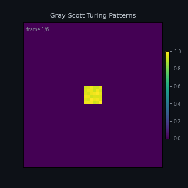

# Imago UniCell

A compute architecture built from one cell type. Every logic function — AND, OR,
XOR, NOR, NAND, NOT, MUX, SELECT — is one cell, one cycle. Programs are portable
`.icm` files that run identically on a Python VM, an iCEBreaker FPGA, a Kintex-7,
or a future ASIC without modification.

---

## The Constraint That Shapes Everything

NOR is universal — any Boolean function can be expressed in NOR alone. The UniCell
takes that further: a single cell contains a 9-input NOR gate tree and selects
which function to perform via a 32-bit `gate_state` configuration word. One cell,
one cycle, 12 possible logic functions.

Cells share a **wired-OR bus**. Two cells writing the same address produce OR of
their outputs — naturally, in hardware, with no arbitration. This is the bus
equivalent of NOR universality.

Everything — programs, OS services, neural clusters, filesystem entries — is built
from this one cell type. The constraint is the point.

---

## Current State

| | |
|---|---|
| Silicon validated | iCEBreaker (iCE40UP5K) — 31/31 tests passing |
| VM tests passing | 133/133 compiler · 236/236 tile library |
| Package | `pip install imago-vm` |
| Hardware in hand | Arria 10 GX660 (Mustang-F100) — programmer pending |

**Confirmed on silicon:** two-arrival model · NOT/AND/OR/XOR/PASS/NOR · latch_in ·
one_shot · invert_out · preload_sel · shift_out_en · CMD_ARRAY_RESET

---

## Demo



*Gray-Scott reaction-diffusion — Turing patterns emerging from random initial conditions.
Running on the UniCell VM. Same cell map loads onto iCEBreaker or Arria 10 hardware unchanged.*

## Silicon Results

iCEBreaker validated (31/31 tests). Hardware cell limit: **4 cells** (16-bit UART
data bus packing). Arria 10 GX660 in hand — Waveshare USB Blaster pending.
`shift_in_en` validation deferred to Arria 10.

---

## Quick Start

```bash
pip install imago-vm

# Run a bundled example
imago run not_gate a=1
imago run adder_int32 a=5 b=3

# Compile your own function
imago compile myfile.py my_function --save my_function.icm

# Launch the workbench (browser UI)
imago-workbench
# → http://localhost:7420
```

```python
import imago
imago.set_verbose(False)

# Load and run
vm = imago.VM()
vm.load_example("adder_int32")
print(vm.run(a=100, b=200))   # {"result": 300}

# Compile from source
vm2 = imago.compile_function(
    "def add(a: signed, b: signed) -> signed:\n    return a and b",
    "add"
)
print(vm2.run(a=1, b=1))
```

---

## The Type System

Every cell carries a 2-bit type declaration in its `gate_state` word:

| Bits 27-28 | Type | Notes |
|------------|------|-------|
| `00` | NUMERIC | unsigned integer, default |
| `01` | SIGNED | two's complement, primary + complement cell pair |
| `10` | ALPHA | 8-bit character / string byte |
| `11` | DATETIME | Unix timestamp, primary + complement cell pair |

Type annotations in source flow all the way through: compiler → cell configuration
→ PTT entries → `.icm` header → WORKSPACE → Ward health monitoring. The cell knows
what it holds. The system knows what it's moving.

This is not a convention. It is in the silicon.

---

## Tile Library

Pre-built verified cell networks. Each tile is a drop-in building block:

| Tile | Cells | Notes |
|------|-------|-------|
| `INT32_ADD` | 482 | Kogge-Stone 32-bit adder, depth 10 |
| `INT32_SUB` | 517 | 32-bit subtractor, depth 12 |
| `INT32_LT_U` | 518 | Unsigned `a < b`, depth 14 |
| `INT32_LT_S` | 523 | Signed `a < b`, depth 16 |
| `INT32_MIN` | 317 | Signed `min(a,b)`, depth 66 |
| `INT32_MAX` | 317 | Signed `max(a,b)`, depth 66 |
| `INT32_CAS` | 711 | Compare-and-swap — sort network primitive |
| `INT32_EQ` | 95 | 32-bit equality, depth 7 |
| `INT32_MUX` | 128 | 32-bit 2:1 multiplexer, depth 3 |
| `FP32_ADD` | 1,253 | 32-bit float add, depth 85 |
| `FP32_MUL` | 3,066 | 32-bit float multiply, depth 89 |
| `MIF_ADD/SUB` | 814/810 | MathTrix Internal Float arithmetic |
| `MIF_MUL/DIV/SQRT` | 3,066/4,789/5,317 | MIF multiply/divide/sqrt |
| `MIF_MADD` | 3,875 | Fused multiply-add (a×b+c) |

Full tile reference: `fp_tiles.py`. All figures from TileLibrary — ground truth.

Full reference: [fp_tiles.py](fp_tiles.py) · [docs/INDEX.md § Tile Library](docs/INDEX.md)

---

## Full Documentation

→ **[docs/INDEX.md](docs/INDEX.md)** — complete searchable index

Key documents:

| | |
|---|---|
| [docs/VM_GETTING_STARTED.md](docs/VM_GETTING_STARTED.md) | New user guide — install to first run (< 5 min) |
| [docs/EXAMPLES.md](docs/EXAMPLES.md) | All runnable examples with commands |
| [docs/LIBRARY.md](docs/LIBRARY.md) | User library — keeping and sharing `.icm` programs |
| [docs/ARCHITECTURE.md](docs/ARCHITECTURE.md) | The full architecture — cell model, bus, OS, type system, portability |
| [docs/RUNNING.md](docs/RUNNING.md) | Workflow: Composer → VM → FPGA |
| [docs/ICM_FORMAT.md](docs/ICM_FORMAT.md) | `.icm` file format specification |
| [docs/neural_pond_design.md](docs/neural_pond_design.md) | LIF and Izhikevich neurons in UniCell |
| [MIGRATION_TODO.md](MIGRATION_TODO.md) | Open work and architecture decisions |
| [fpga/README_FPGA.md](fpga/README_FPGA.md) | FPGA bring-up guide |
