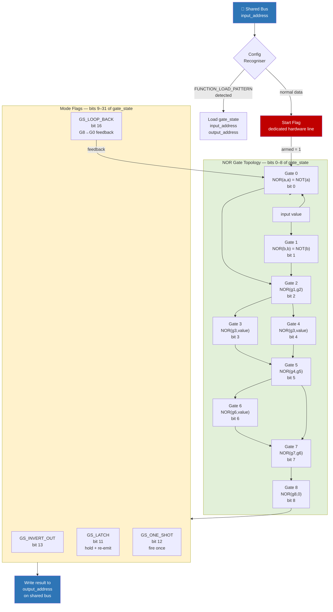

```mermaid
flowchart TD
    BUS["🚌 Shared Bus\ninput_address"]
    SF["Start Flag\ndedicated hardware line"]
    
    BUS --> CG{"Config\nRecogniser"}
    CG -->|"FUNCTION_LOAD_PATTERN\ndetected"| CFG["Load gate_state\ninput_address\noutput_address"]
    CG -->|"normal data"| SF
    SF -->|"armed = 1"| G0

    subgraph NOR["NOR Gate Topology — bits 0–8 of gate_state"]
        direction TB
        IN["input value"]
        G0["Gate 0\nNOR(a,a) = NOT(a)\nbit 0"]
        G1["Gate 1\nNOR(b,b) = NOT(b)\nbit 1"]
        G2["Gate 2\nNOR(g1,g2)\nbit 2"]
        G3["Gate 3\nNOR(g3,value)\nbit 3"]
        G4["Gate 4\nNOR(g3,value)\nbit 4"]
        G5["Gate 5\nNOR(g4,g5)\nbit 5"]
        G6["Gate 6\nNOR(g6,value)\nbit 6"]
        G7["Gate 7\nNOR(g7,g6)\nbit 7"]
        G8["Gate 8\nNOR(g8,0)\nbit 8"]

        IN --> G0
        IN --> G1
        G0 --> G2
        G1 --> G2
        G2 --> G3
        G2 --> G4
        G3 --> G5
        G4 --> G5
        G5 --> G6
        G6 --> G7
        G5 --> G7
        G7 --> G8
    end

    G0 --> NOR
    G8 --> MF

    subgraph MF["Mode Flags — bits 9–31 of gate_state"]
        direction LR
        INV["GS_INVERT_OUT\nbit 13"]
        LATCH["GS_LATCH\nbit 11\nhold + re-emit"]
        OS["GS_ONE_SHOT\nbit 12\nfire once"]
        LB["GS_LOOP_BACK\nbit 16\nG8→G0 feedback"]
    end

    MF --> OUT["Write result to\noutput_address\non shared bus"]
    LB -->|"feedback"| G0

    style BUS fill:#2E75B6,color:#fff
    style SF fill:#C00000,color:#fff
    style NOR fill:#E2F0D9
    style MF fill:#FFF2CC
    style OUT fill:#2E75B6,color:#fff
```
