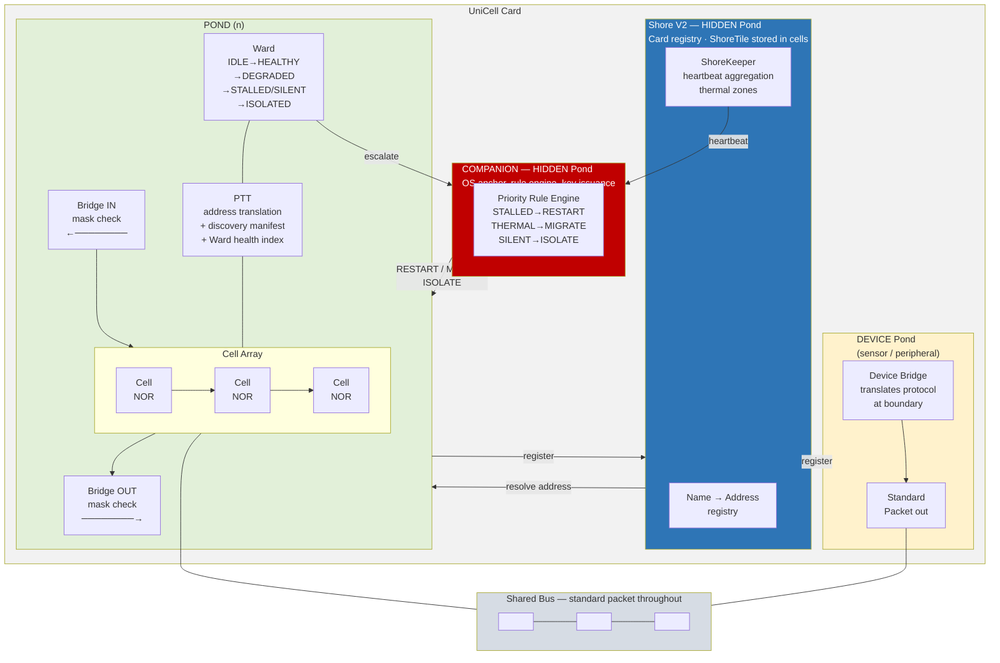

```mermaid
flowchart TD
    subgraph CARD["UniCell Card"]
        subgraph COMP["COMPANION — HIDDEN Pond\nOS anchor, rule engine, key issuance"]
            RULES["Priority Rule Engine\nSTALLED→RESTART\nTHERMAL→MIGRATE\nSILENT→ISOLATE"]
        end

        subgraph SHORE["Shore V2 — HIDDEN Pond\nCard registry · ShoreTile stored in cells"]
            REG["Name → Address\nregistry"]
            SK["ShoreKeeper\nheartbeat aggregation\nthermal zones"]
        end

        subgraph POND["POND (n)"]
            direction TB
            BI["Bridge IN\nmask check\n←────────"]
            subgraph CELLS["Cell Array"]
                C1["Cell\nNOR"]
                C2["Cell\nNOR"]
                C3["Cell\nNOR"]
                C1 --> C2 --> C3
            end
            BO["Bridge OUT\nmask check\n────────→"]
            PTT["PTT\naddress translation\n+ discovery manifest\n+ Ward health index"]
            WARD["Ward\nIDLE→HEALTHY\n→DEGRADED\n→STALLED/SILENT\n→ISOLATED"]

            BI --> CELLS
            CELLS --> BO
            PTT --- CELLS
            WARD --- PTT
        end

        subgraph DEVICE["DEVICE Pond\n(sensor / peripheral)"]
            DB["Device Bridge\ntranslates protocol\nat boundary"]
            DS["Standard\nPacket out"]
            DB --> DS
        end
    end

    WARD -->|"escalate"| COMP
    COMP -->|"RESTART / MIGRATE\nISOLATE"| POND
    SHORE -->|"resolve address"| POND
    POND -->|"register"| SHORE
    DEVICE -->|"register"| SHORE
    SK -->|"heartbeat"| COMP

    subgraph BUS["Shared Bus — standard packet throughout"]
        direction LR
        B1[" "] --- B2[" "] --- B3[" "]
    end

    CELLS --- BUS
    DS --- BUS

    style COMP fill:#C00000,color:#fff
    style SHORE fill:#2E75B6,color:#fff
    style POND fill:#E2F0D9
    style DEVICE fill:#FFF2CC
    style BUS fill:#D6DCE4
    style CARD fill:#F2F2F2
```
