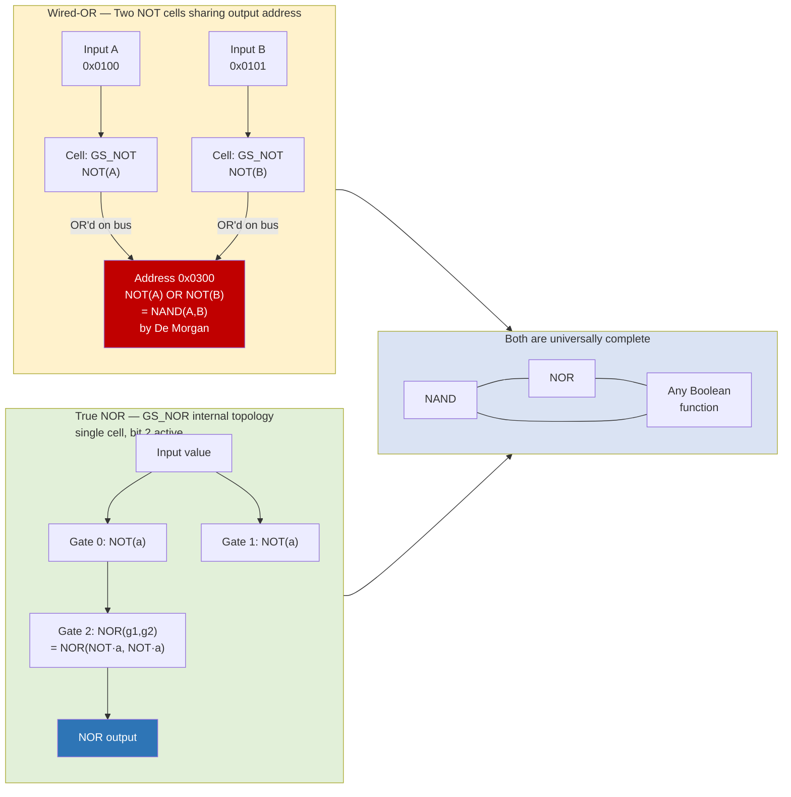

```mermaid
flowchart LR
    subgraph WIRED["Wired-OR — Two NOT cells sharing output address"]
        direction TB
        A["Input A\n0x0100"] --> NA["Cell: GS_NOT\nNOT(A)"]
        B["Input B\n0x0101"] --> NB["Cell: GS_NOT\nNOT(B)"]
        NA -->|"OR'd on bus"| NAND["Address 0x0300\nNOT(A) OR NOT(B)\n= NAND(A,B)\nby De Morgan"]
        NB -->|"OR'd on bus"| NAND
    end

    subgraph TRUE_NOR["True NOR — GS_NOR internal topology\nsingle cell, bit 2 active"]
        direction TB
        A2["Input value"] --> G0_["Gate 0: NOT(a)"]
        A2 --> G1_["Gate 1: NOT(a)"]
        G0_ --> G2_["Gate 2: NOR(g1,g2)\n= NOR(NOT·a, NOT·a)"]
        G2_ --> OUT_["NOR output"]
    end

    subgraph SCALE["Both are universally complete"]
        direction LR
        N1["NAND"] --- N2["NOR"]
        N2 --- N3["Any Boolean\nfunction"]
        N1 --- N3
    end

    WIRED --> SCALE
    TRUE_NOR --> SCALE

    style WIRED fill:#FFF2CC
    style TRUE_NOR fill:#E2F0D9
    style SCALE fill:#DAE3F3
    style NAND fill:#C00000,color:#fff
    style OUT_ fill:#2E75B6,color:#fff
```
